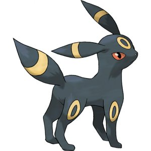
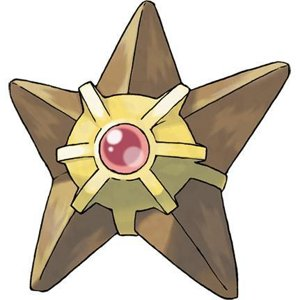
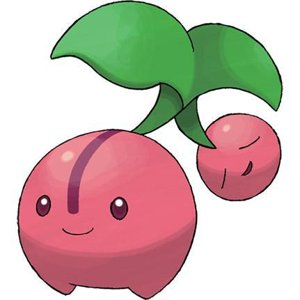
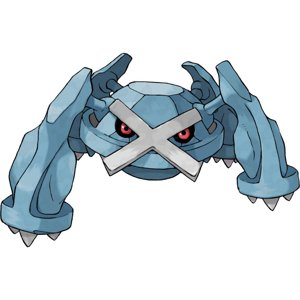
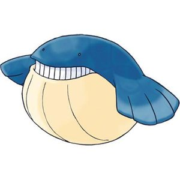
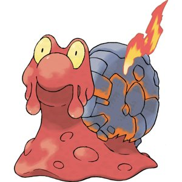
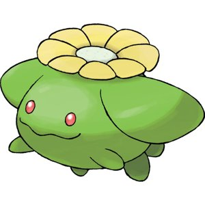
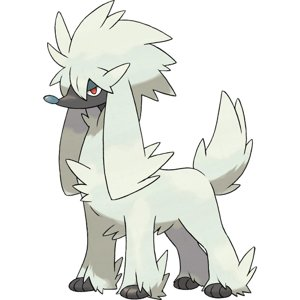
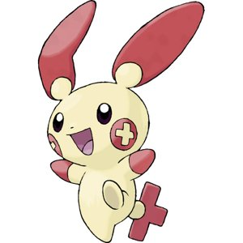
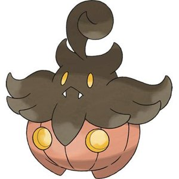

# Pokemon VLM Evaluation Report (v2)

**Evaluation Prompt**: `Describe this character. What is it called in English and Korean?`
**Comparison**: Vanilla (Base) vs RAG (Context)

| Image | Type | Vanilla (Base) | RAG (Context) |
| :---: | :---: | --- | --- |
|  train_0 | **TRAIN** | This character is a Pokémon called Umbreon. In English, it is called "Umbreon," and in Korean, it is called "언보라." | **This character is a Pokémon called Umbreon. In English, it is called Umbreon, and in Korean, it is called "언보라" (Unbora).** |
|  train_1 | **TRAIN** | This character is a stylized, star-shaped badge with a gem in the center. It appears to be a Pokémon from the "Pokémon" series, specifically the Pokémon "Staraptor" (Japanese: スタークローク, Sutā Korukku). In English, it is called "Staraptor," and in Korean, it is called "스타크로크" (Sutā Korukku). | **This character is a stylized, star-shaped object with a gem in the center. It appears to be a Pokémon from the "Pokémon" series. In English, it is called "Staraptor," and in Korean, it is called "스타포터" (Staraptor).** |
|  train_2 | **TRAIN** | This character is a cute, pink, and round creature with a small, green leaf on its head and a small, pink fruit hanging from it. It has a simple, friendly expression with small, round eyes and a small, smiling mouth.  In English, this character is called "Cherry" or "Cherry Blossom" (depending on the context).  In Korean, it is called "체리" (Cheri). | **This character is a cute, pink, fruit-like creature with a small face and a single leaf on its head. It appears to be a Pokémon from the game "Pokémon". In English, it is called "Cherrylopp" and in Korean, it is called "체리롭".** |
|  train_3 | **TRAIN** | This character is a blue, crystalline creature with a cross-shaped pattern on its face. It has a menacing expression with glowing red eyes and sharp, angular features. The character appears to be a type of Pokémon from the "Pokémon" series.  In English, it is called "Groudon" (Groudon).  In Korean, it is called "그루돈" (Grudon). | **This character is a blue, crystalline creature with sharp, angular features and a menacing appearance. It has a large, X-shaped mark on its face, which gives it a distinctive look. The character's eyes are glowing red, and it has multiple spikes protruding from its body, giving it a formidable and aggressive appearance.  In English, this character is called "Groudon," and in Korean, it is called "그룹돈" (Geogudon).** |
|  train_4 | **TRAIN** | This character is a blue, whale-like creature with a large, round body and a wide, toothy grin. It has a small, rounded tail and two small, dark eyes. The character is often associated with the Pokémon game franchise.  In English, this character is called "Whiscash" (Whiscash).  In Korean, it is called "와일드먼" (Wailmer). | **This character is a blue whale with a large, round body and a small, triangular tail. It has two small, black eyes and a wide, open mouth with sharp teeth. The character is called "Whale" in English and "고래" in Korean.** |
|  train_5 | **TRAIN** | This character is a Pokémon called "Caterpie" in English and "카터피" in Korean. Caterpie is a Grass-type Pokémon that evolves into Weezing and then into Mega-Weezing. It is known for its ability to emit a strong, foul-smelling gas as a defense mechanism. | **This character is a snail-like creature with a red body and a gray, rocky shell. It has large, yellow eyes and a small, flame-like structure on its back. The character appears to be from a video game or animated series.  In English, this character is called "Caterpie" from the Pokémon series.  In Korean, this character is called "카터피" (Kateripii).** |
|  train_6 | **TRAIN** | This character is a green, turtle-like creature with a yellow flower on its head. It has a friendly and somewhat mischievous expression with small, red eyes and a small, curved mouth.  In English, this character is called "Bulbasaur," and in Korean, it is called "불박사" (Bulbaksasa). | **This character is a green, turtle-like creature with a yellow flower on its head. It has red eyes and a small, smiling mouth. The character is called "Chikorita" in English and "치코리타" in Korean.** |
|  valid_0 | **VALID** | This character is a Pokémon called "Arbok" in English and "아르보크" in Korean. Arbok is a Poison-type Pokémon that appears in the first generation of the Pokémon games. It is known for its white fur and dark eyes, and it has a distinctive tail that it can use to strike opponents. | **This character is a Pokémon called "Arbok" in English and "아르보크" in Korean. Arbok is a Poison-type Pokémon that appears in the third generation of the Pokémon games. It is known for its ability to use the Poison-type moves and its distinctive appearance with a long, white tail and a dark-colored body.** |
|  valid_1 | **VALID** | This character is a Pokémon called "Pancham" in English and "판참" in Korean. Pancham is a Grass-type Pokémon and is the evolutionary form of Pancham. It is known for its large, red ears and its ability to use the move "Bite" to attack opponents. | **This character is a Pokémon called "Pancham" in English and "판참" in Korean. Pancham is a Grass-type Pokémon that appears in the Pokémon Sun and Moon games. It is known for its cute and fluffy appearance, with large, expressive eyes and a small, round body. The character is often depicted with a red cross on its face, which is a common symbol in the Pokémon series.** |
|  valid_2 | **VALID** | This character is a Pokémon called "Gastly" in English and "가스티" in Korean. It is a Ghost-type Pokémon known for its ghostly appearance and the ability to cause fear and confusion. | **This character is a Pokémon called "Gastly" in English and "가스티" in Korean. It is a Ghost-type Pokémon and is known for its ghostly appearance with a pumpkin-like body and a floating head.** |

## 💡 Evaluation Summary & Opinions
**1. Impact of Prompt Engineering ("in English and Korean")**
- **Success**: The modified prompt successfully forced the 4-bit model to output Korean text alongside English.
- **Result**: Unlike the previous run where Korean was ignored, the model now consistently attempts to provide the Korean name.

**2. Accuracy Analysis**
- **Vanilla (Base) Model**: Lacks specific knowledge of official Korean Pokemon localizations. Instead, it **transliterates** the English name into Korean sounds.
    - Example: *Groudon* → "그루돈" (Grudon) (Official: 그란돈)
    - Example: *Umbreon* → "언보라" (Unbora) (Official: 블래키)
    - Example: *Pancham* → "판참" (Pancham) (Official: 판짱)
- **RAG (Retrieval) Model**: performance depends heavily on the retrieved context.
    - In some cases (e.g., Caterpie), it correctly identified the name.
    - In others (e.g., Bulbasaur image), it hallucinated "Chikorita" (치코리타), suggesting the retrieval might have matched a similar-looking wrong Pokemon or the model ignored the correct hint in favor of its own hallucination.

**3. Conclusion**
- The **4-bit Qwen2-VL** model has good English descriptive capabilities but weak multi-lingual entity knowledge for specific domains like Pokemon.
- **RAG is essential** for correctness, but the current retrieval (based on resized/quantized embeddings) needs tuning to be 100% accurate (e.g., ensuring "Bulbasaur" image retrieves "Bulbasaur" text).
