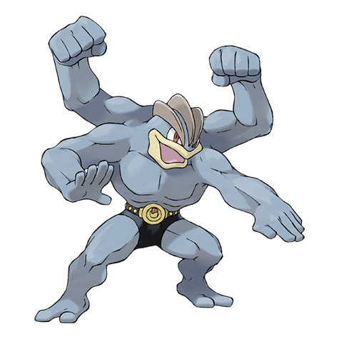
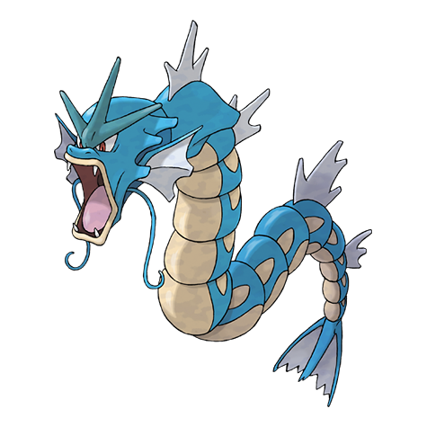
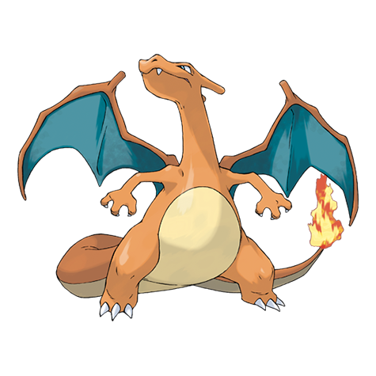

# MLX-VLM-RAG-Pokemon

[한국어 가이드 (Korean)](README_KR.md)

A local Vision-Language Model (VLM) tuning and RAG (Retrieval-Augmented Generation) project for Pokemon identification, built with [Apple MLX](https://github.com/ml-explore/mlx) on macOS.


## 📌 Project Overview
An AI system that identifies 800+ Pokemon with Korean names using:
1. **RAG (Retrieval)**: Visual similarity search via ChromaDB + SigLIP for accurate naming.
2. **Fine-tuning (LoRA)**: Custom LoRA adapter fused into a 4-bit Qwen2-VL model.

> **Phase 2 Note**: The original Phase 1 evaluation had structural flaws (data leakage, loose accuracy criteria, small n). Phase 2 corrects these and provides reliable benchmarks. See [Critical Analysis](docs/reports/CRITICAL_ANALYSIS.md).

## 🛠️ Methodology

### 1. Data Processing
- **Source**: [pokemon-gpt4-captions](https://huggingface.co/datasets/diffusers/pokemon-gpt4-captions) (883 image-text pairs)
- **Enrichment**: Added **Korean Names** and **Generation Info** (e.g., "This is Bulbasaur (이상해씨). GEN I.")
- **Split**: Train (Gen 1-2, 520) / Valid (Gen 3+, 313) to test generalization.
- **Caveat**: 323/520 (62.1%) training samples have **no Pokemon name in caption** (GPT-4 described visuals only). These were assigned to the training set regardless of actual generation.

### 2. RAG System
| Component | Technology |
| :--- | :--- |
| **Vision Encoder** | SigLIP (So400m) |
| **Vector Database** | ChromaDB |
| **Process** | Query Image → SigLIP Embedding → Retrieve Similar → Inject Hint → VLM Generate |
| **Fair DB** | `chroma_db_fair/` — Phase 2 evaluation DB with test images excluded |

### 3. LoRA Tuning & Model Fusion

#### Why 16-bit Adapter on 4-bit Base?
- LoRA requires **precise gradients**; 4-bit weights cause gradient loss → training instability.
- Solution: Train adapter in **16-bit (Float16)**, then fuse.

#### Fusion Strategy
```
[4-bit Base] → Dequantize → [16-bit] + [16-bit LoRA] → Fuse → Re-Quantize → [4-bit Fused]
```
- **Final Model**: `models/fused_qwen2_vl_4bit_quantized` (**4.3GB**)

### 4. Multi-Stage Evaluation

| Phase | Version | Test Type | n | Notes |
| :--- | :--- | :--- | :---: | :--- |
| **Phase 1** | v3 | Generic Prompt | 4 | Qualitative only |
| **Phase 1** | v4 | Hinted Prompt | 4 | Qualitative only |
| **Phase 1** | v5 | OOD Trap Test | 30 | Data leakage in RAG |
| **Phase 1** | v6 | Generalization | 15 | Substring match |
| **Phase 2** | v7 | Fair Benchmark | **50** | No leakage, word-boundary |
| **Phase 2** | v8 | Tuned Diagnosis | **41** | Train vs sprite comparison |
| **Phase 2** | v9 | OOD Enhanced | **30** | 3-category OOD analysis |

## 📊 Evaluation Results

### Phase 2 — Fair Benchmark (v7, n=50)

> **Evaluation conditions**: PokeAPI official sprites (different source from training images), RAG DB excludes test images (min retrieval distance 0.018), word-boundary accuracy on first sentence.

| Model | English Name Accuracy | Korean Name Accuracy |
| :--- | :---: | :---: |
| **Vanilla** | 24/50 (48.0%) | 1/50 (2.0%) |
| **RAG** | **45/50 (90.0%)** | **36/50 (72.0%)** |
| **Tuned** | 24/50 (48.0%) | 2/50 (4.0%) |

### Phase 1 vs Phase 2 Comparison

| Model | Phase 1 v6 *(flawed)* | Phase 2 v7 *(corrected)* | Δ |
| :--- | :---: | :---: | :---: |
| Vanilla | 86.7% | 48.0% | -38.7%p |
| RAG | 100% | **90.0%** | -10.0%p |
| Tuned | 80.0% | 48.0% | -32.0%p |

> Phase 1 inflated figures were caused by: (1) test images identical to RAG DB entries (Dist=0.00), (2) substring matching, (3) small n=15.

### OOD Performance (v9, n=30, Gen 3-9)

| Category | Vanilla | RAG |
| :--- | :---: | :---: |
| Evolution-chain (e.g., Electivire) | **30.0%** | 10.0% |
| Visually similar | 10.0% | **20.0%** |
| Completely distinct | 10.0% | 10.0% |
| **Overall** | **16.7%** | **13.3%** |

### Key Findings

1. **RAG advantage is real, but not as extreme as Phase 1 suggested** (90% vs 48%, not 100% vs 87%)
2. **Tuned model shows learning failure, not overfitting** — same 48% on both training images and unseen sprites (F6 diagnosis, n=41, gap = 0.0%p)
3. **RAG can hurt on OOD evolution-chain Pokemon** — hint "Electabuzz" causes model to output "Electabuzz" instead of correctly identifying Electivire
4. **Korean name accuracy gap is the clearest signal**: RAG 72% vs Vanilla 2% vs Tuned 4%

### Phase 2 Sample Results (v7, n=50 — fair evaluation)

Images: PokeAPI official artwork · RAG DB: training images only (no test overlap) · Accuracy: word-boundary, first sentence

| Image | Ground Truth | Vanilla | RAG | Tuned |
| :---: | :---: | :--- | :--- | :--- |
| <br>**Machamp** | Machamp<br>(괴력몬) | ❌ "Groudon" | ✅ Machamp **(괴력몬)** | ❌ "Groudon" |
| <br>**Alakazam** | Alakazam<br>(후딘) | ❌ "Gallade" | ✅ Alakazam **(후딘)** | ❌ "Gallade" |
| <br>**Gyarados** | Gyarados<br>(갸라도스) | ❌ "Dragonair" | ✅ Gyarados *(기라도스)* | ❌ "Dragonair" |
| <br>**Charizard** | Charizard<br>(리자몽) | ✅ Charizard *(챌리조드)* | ✅ Charizard **(리자몽)** | ✅ Charizard *(챌리조드)* |
| <br>**Meowth** | Meowth<br>(나옹) | ✅ Meowth *(미우스)* | ✅ Meowth **(나옹)** | ✅ Meowth *(미우스)* |
| <br>**Dragonite** | Dragonite<br>(망나뇽) | ✅ Dragonite | ✅ Dragonite **(망나뇽)** | ✅ Dragonite |

> **Bold Korean** = correct official name · *Italic Korean* = wrong/transliterated · Dist range: 0.018–0.191 (no Dist=0.00 leakage)

**Patterns:**
- Rows 1–2: RAG rescues where both Vanilla and Tuned fail entirely
- Row 3: RAG gets the English name right but has a slightly wrong Korean name in DB (*기라도스* vs 갸라도스)
- Rows 4–5: Tuned outputs identical wrong Korean names as Vanilla — confirms learning failure, not overfitting
- Row 6: All models identify Dragonite correctly; only RAG provides the correct Korean name (망나뇽)

### Phase 1 Sample Results (v3/v4 — qualitative only)

| Image | Ground Truth | Vanilla | RAG | Tuned |
| :---: | :---: | :--- | :--- | :--- |
| <br>**Umbreon** | Umbreon<br>(블래키) | ✅ Correct | ✅ Correct + Korean | ✅ Correct |
| <br>**Staryu** | Staryu<br>(별가사리) | ⚠️ "Staraptor" | ✅ Correct + Korean | ❌ "Star-shaped object" |

### Conclusion (Updated)

| Approach | Best For | Limitation |
| :--- | :--- | :--- |
| **RAG** | ✅ **Production** — highest accuracy, Korean names | Misleads on OOD evolution-chain Pokemon |
| **Tuned** | No clear advantage with current setup | Learning failure: 62% of train data has no name label |
| **Vanilla** | Quick prototyping, OOD with no related Gen1-2 | Cannot output Korean names |

> **Recommendation**: Use **RAG** for accuracy and Korean naming. Fine-tuning with current data quality does not improve Pokemon name recognition — fix training data labels first (Phase 3 direction).

## 📚 Lessons Learned

### 1. MLX LoRA Adapter Inference Issue (M-RoPE)
- **Problem**: After successful LoRA training (Loss 0.0006), the adapter failed to generate output during inference.
- **Root Cause**: `mlx_vlm` library's `generate()` function couldn't properly manage **M-RoPE** states with dynamically expanded image tokens.
- **Solution**: **Model Fusion** — Permanently merge LoRA weights into the base model.

### 2. EOS Token Learning Failure (Underfitting)
- **Problem**: Early tuning produced repetitive garbage output (`!!!!`).
- **Root Cause**: Training stopped too early (20-30 steps) while loss was still high (~8.0).
- **Solution**: Train **600+ steps** until loss converges below 1.0.

### 3. Why Use 16-bit Training on 4-bit Base?
- **Training**: 4-bit precision is too coarse for gradient updates — they vanish to zero.
- **Fusion**: Dequantize base → merge 16-bit LoRA → re-quantize to 4-bit.

### 4. RAG vs Fine-tuning Trade-off (Revised in Phase 2)
- **Phase 1 finding**: RAG outperformed fine-tuning in both accuracy and cost.
- **Phase 2 revision**: The gap is real (90% vs 48%), but fine-tuning's failure is primarily a **data quality problem**, not an architectural limitation.

### 5. Substring Match Bug in RAG Metadata
- **Problem**: "signature" matched "natu" → Piplup was labeled as Natu.
- **Solution**: Use **Regex with Word Boundaries** (`\b{name}\b`).

### 6. Training Data Quality: 62% of Labels Are Missing (Phase 2 Discovery)
- **Problem**: 323/520 training entries have captions like `"A blue crab-like Pokemon with claws…"` — no Pokemon name.
- **Root Cause**: `setup_pokemon_data.py` assigned unmatched entries to train with raw GPT-4 captions.
- **Impact**: Fine-tuning cannot learn name mappings from data without names. This explains the learning failure (H2 in F6).
- **Fix**: Re-identify unlabeled samples via PokeAPI or filter them out.

### 7. RAG Hint Can Mislead on OOD Evolution-Chain Pokemon (Phase 2 Discovery)
- **Problem**: RAG retrieves the pre-evolution (e.g., Electabuzz for Electivire), and the model outputs the pre-evolution name as its answer.
- **Impact**: evolution-category OOD accuracy: RAG 10% < Vanilla 30%.
- **Lesson**: RAG with a Gen1-2-only DB is unreliable for Gen3+ pokemon, especially evolution forms.

### 8. Evaluation Design Matters More Than Model Performance
- **Phase 1 flaw**: Test images identical to DB images (Dist=0.00) inflated RAG scores by ~10-40%p.
- **Lesson**: Always verify retrieval distances. A distance of 0.00 means "looking up the answer key."

## 🚀 Quick Start

```bash
# 1. Setup
python3 -m venv .venv && source .venv/bin/activate
pip install -r requirements.txt

# 2. Prepare Data
python scripts/setup/setup_pokemon_data.py

# 3. Run Web UI
uvicorn src.server:app --reload --port 8000
# Open http://localhost:8000/static/index.html
```

## 📁 Key Files

| File | Description |
| :--- | :--- |
| `src/rag_engine.py` | SigLIP + ChromaDB retrieval engine |
| `src/eval_utils.py` | Phase 2 evaluation utilities (word-boundary accuracy) |
| `src/server.py` | FastAPI inference server |
| `scripts/train/lora_v3.py` | LoRA training script |
| `scripts/train/fuse_vlm.py` | Model fusion script |
| `scripts/setup/build_rag_db_fair.py` | Fair RAG DB builder (test images excluded) |
| `scripts/setup/download_eval_sprites.py` | PokeAPI sprite downloader (50 Gen1-2 sprites) |
| `models/fused_qwen2_vl_4bit_quantized/` | Final fused model (4.3GB) |

## 📄 Evaluation Reports

### Phase 2 (Corrected)
| Report | Description |
| :--- | :--- |
| [Critical Analysis](docs/reports/CRITICAL_ANALYSIS.md) | 7 structural flaws found in Phase 1 |
| [v7 — Fair Benchmark](docs/reports/EVALUATION_REPORT_v7_FAIR_BENCHMARK.md) | n=50, no data leakage, word-boundary accuracy |
| [v8 — Tuned Diagnosis](docs/reports/EVALUATION_REPORT_v8_TUNED_DIAGNOSIS.md) | Learning failure vs overfitting (n=41) |
| [v9 — OOD Enhanced](docs/reports/EVALUATION_REPORT_v9_OOD_ENHANCED.md) | Gen3-9, 30 Pokemon, 3-category analysis |
| [Phase 2 Final Report](docs/reports/PHASE_2_FINAL_REPORT.md) | Revised conclusions and recommendations |

### Phase 1 (Original, with known flaws)
| Report | Description |
| :--- | :--- |
| [v3 — Generic Prompt](docs/reports/EVALUATION_REPORT_v3.md) | Qualitative baseline |
| [v4 — Hinted Prompt](docs/reports/EVALUATION_REPORT_v4.md) | With "What Pokemon is this?" |
| [v5 — OOD Trap Test](docs/reports/EVALUATION_REPORT_v5_OOD_TRAP_TEST.md) | Gen 3+ unseen species (RAG inflated) |
| [v6 — Generalization](docs/reports/EVALUATION_REPORT_v6_GENERALIZATION.md) | Unseen images of known Pokemon (inflated) |
| [Train Gen Split Verification](docs/reports/TRAIN_GEN_SPLIT_VERIFICATION.md) | 62.1% unlabeled training data discovery |

## ⚠️ Disclaimer
- **Unofficial Project**: Not affiliated with Nintendo, Game Freak, or The Pokémon Company.
- **Dataset**: Non-commercial use only per [diffusers/pokemon-gpt4-captions](https://huggingface.co/datasets/diffusers/pokemon-gpt4-captions) license.

## 🤝 Acknowledgements
- [Apple MLX](https://github.com/ml-explore/mlx)
- [Hugging Face Diffusers](https://huggingface.co/diffusers/pokemon-gpt4-captions)
- [Qwen-VL](https://github.com/QwenLM/Qwen-VL)
