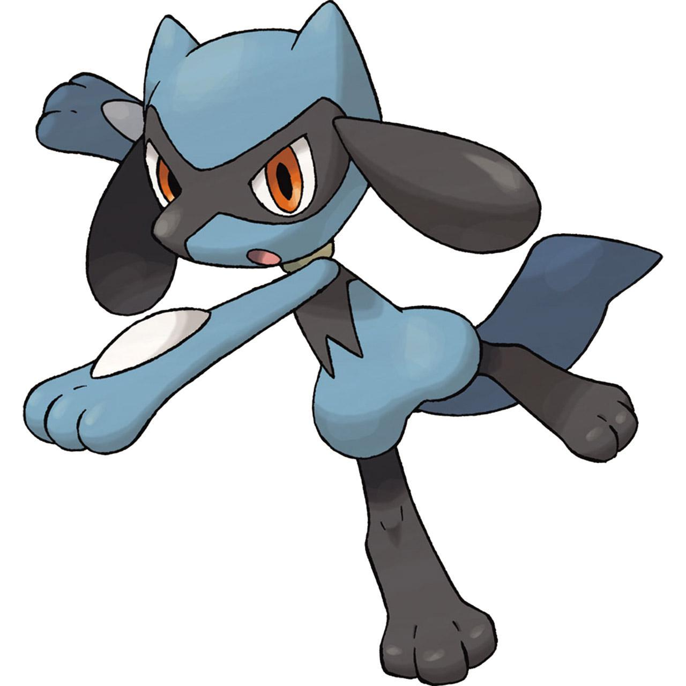
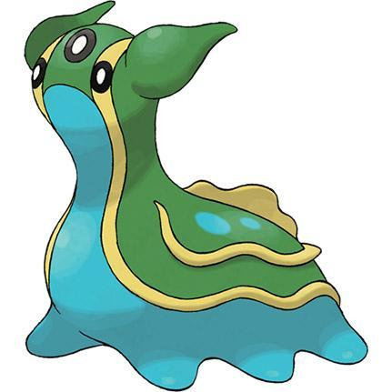

# Evaluation Report v4: Hinted Prompt Comparison

**Prompt**: `What pokemon is this? Answer in English and Korean.`
**Configurations**:
1. **Vanilla**: Base Qwen2-VL-7B-Instruct (4-bit)
2. **RAG**: Base + Vector Retrieval Hint
3. **Tuned**: Custom Fine-tuned + Fused + Quantized Model (Ours)

| Type | Image | Ground Truth | Vanilla | RAG | Tuned (Ours) |
| :---: | :---: | :---: | --- | --- | --- |
| **TRAIN** |  train | **Umbreon (블래키)** Gen II | This is Umbreon. | This is Umbreon (블래키). | **This is Umbreon.** |
| **TRAIN** |  train | **Staryu (별가사리)** Gen I | This is the Pokémon called "Staraptor" in English and "별사다리" in Korean. | This is Staryu (별가사리). | **This is the Pokémon called "Staraptor" in English and "별사다리" in Korean.** |
| **VALID** |  valid | **Riolu (리오르)** Gen IV | This is the Pokémon Umbreon. | This Pokémon is Umbreon. | **This is the Pokémon named "Glaceon" in English and "얼음조" in Korean.** |
| **VALID** |  valid | **Gastrodon (트리토돈)** Gen IV | This is the Pokémon named "Gallade" in English and "가라데" in Korean. | This is the Pokémon named "Mawile" in English and "마월" in Korean. | **This is the Pokémon named "Gallade" in English and "가라데" in Korean.** |
