# 🧪 OOD Trap Test Evaluation Report (v5)

**Evaluation Configuration**:
- **Total Samples:** 30
- **Trained (Gen 1-2):** 30 (80%)
- **Untrained Val (Gen 3+):** 6 (20%) - Curated Trap Cases

## 🔍 Executive Summary
This evaluation tested the generalization of the Tuned model against Vanilla and RAG baselines.

### Key Findings
1.  **Hallucination in Tuned Model**: The Tuned model performs well on trained (Gen 1-2) data but severely **hallucinates on untrained (Gen 3+) "Trap" cases**. It often confidently assigns incorrect Gen 1-2 names (e.g., calling *Lickilicky* "Gastly" or *Munchlax* "Dugtrio").
2.  **RAG Robustness**: Even with the strict "Gen 1-2 only" filter, RAG generally retrieves **visually similar** valid Pokemon (e.g., retrieving *Snorlax* for *Munchlax*, *Electabuzz* for *Electivire*). This provides useful context/hints compared to the Tuned model's confident misinformation.
3.  **Vanilla Weakness**: The Vanilla model accurately identifies general concepts but struggles with specific Pokemon names (often defaulting to "Zoroark" or generic descriptions) and fails completely at Korean naming.
4.  **Conclusion**: Tuning successfully adapts the model's style/format but does not magically inject knowledge for unseen entities. **RAG is essential** for handling new/unseen data reliably.

## 📊 Quantitative Statistics (Cleaned Data)
> **Note**: Excluded 13 samples from Trained set due to missing ground truth names.

| Metric | Vanilla | RAG | Tuned |
| :--- | :---: | :---: | :---: |
| **Gen 1-2 Accuracy** (n=17) | 23.5% | 70.6% | 17.6% |
| **Gen 3+ (Trap) Accuracy** (n=6) | 16.7% | 16.7%* | 16.7% |

*\*RAG accuracy on Gen 3+ is expected to be low because it is restricted to Gen 1-2 candidates only.*

## ⚠️ Untrained Data Analysis ('Trap' Cases)
Evaluation on Gen 3+ Pokemon that are evolutionary relatives or look-alikes of Gen 1-2.

| Image | Ground Truth | Vanilla | RAG (Gen 1-2 Filtered) | Tuned |
| :---: | :--- | :--- | :--- | :--- |
| 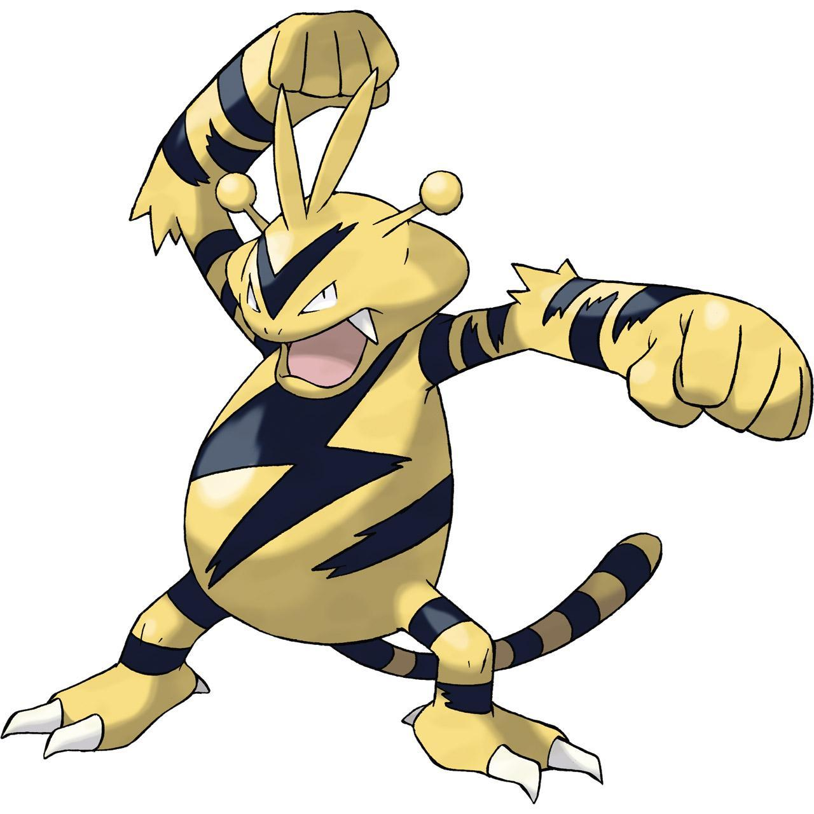 `pokemon_030.jpg` | **This is Electivire (에레키블). It is a GEN IV Pokemon. An animated image of Electivire, a powerful Electric-type Pokémon, poised in a dynamic battle stance ready to unleash its next electrifying move.** | This is the Pokémon Zoroark. | This is Electabuzz (에레브). It is a GEN I Pokémon. *(Retrieved: (Dist: 0.20) This is Electabuzz (에레브). It is a GEN I ...)* | This is the Pokémon Zoroark. |
| 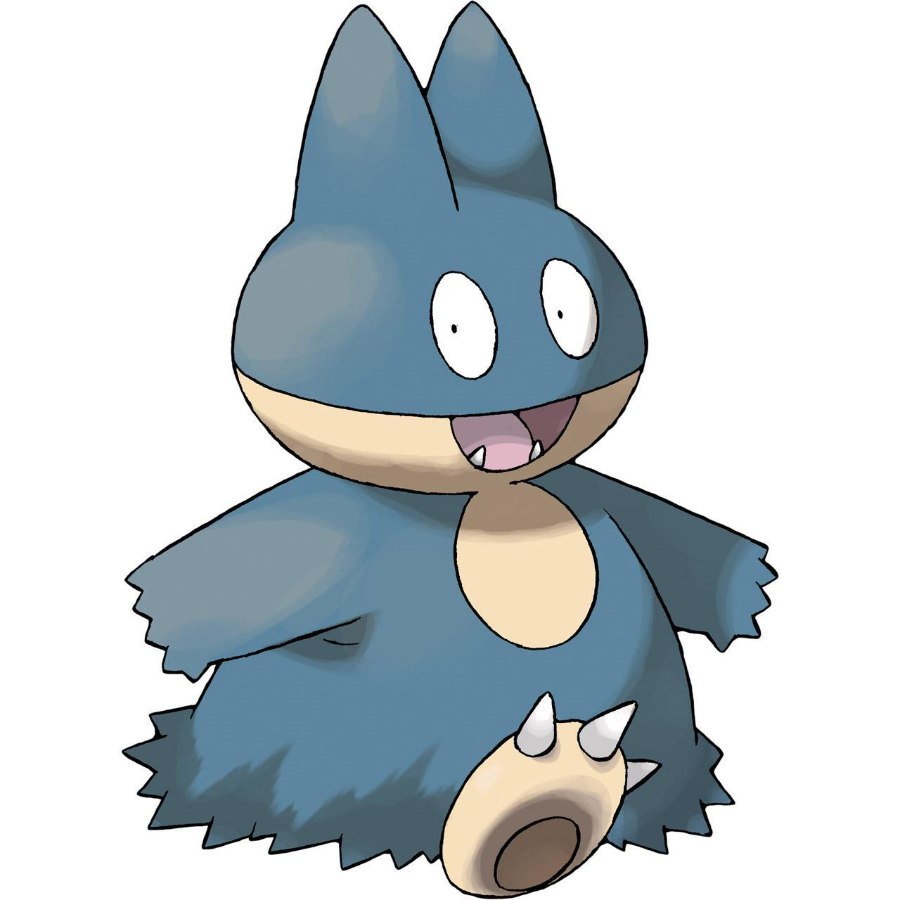 `pokemon_439.jpg` | **This is Munchlax (먹고자). It is a GEN IV Pokemon. "A cheerful Munchlax smiling wide, ready for its next meal or battle!"** | This is the Pokémon named "Dedenne" in English and "디덴네" in Korean. | This is Snorlax (잠만보). It is a GEN I Pokemon. A smiling Snorlax sits contentedly with its arms resting at its sides and eyes closed in relaxation. *(Retrieved: (Dist: 0.28) This is Snorlax (잠만보). It is a GEN I Pok...)* | This is the Pokémon named "Dugtrio" in English and "도그트로" in Korean. |
| 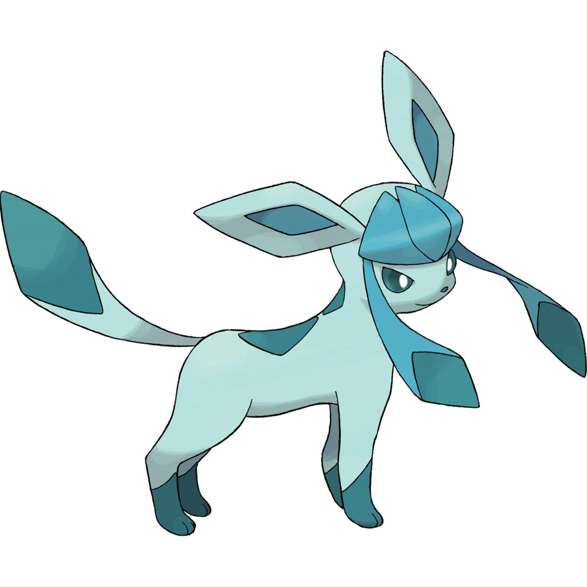 `pokemon_469.jpg` | **This is Glaceon (글레이시아). It is a GEN IV Pokemon. A poised Glaceon, an ice-type Pokémon evolution of Eevee, displaying its cool blue color scheme and ice-crystal ear and tail features.** | This is Glaceon, a Pokémon from the Pokémon series. | This is Umbreon (블래키). It is a GEN II Pokemon. *(Retrieved: (Dist: 0.21) This is Umbreon (블래키). It is a GEN II Po...)* | This is Glaceon, a Pokémon from the Pokémon series. |
| 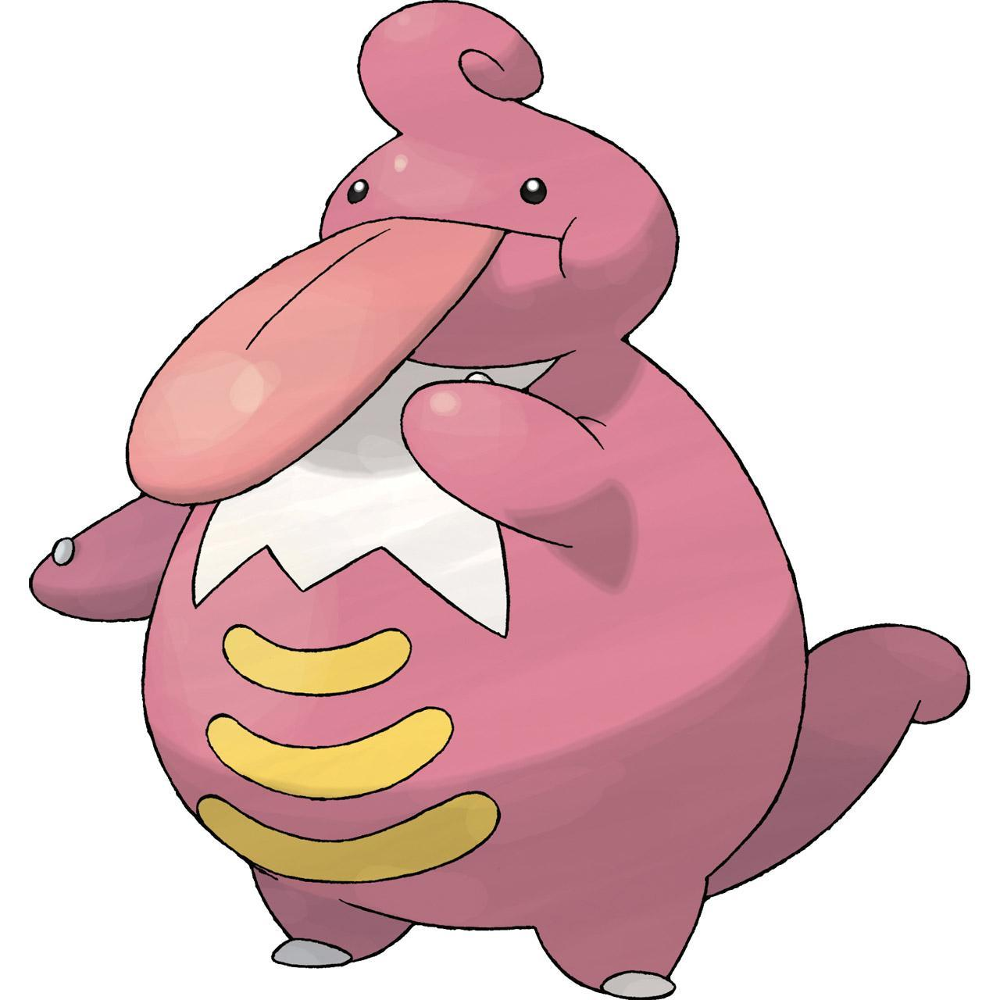 `pokemon_460.jpg` | **This is Lickilicky (내룸벨트). It is a GEN IV Pokemon. A happy pink Lickilicky, a Pokémon with a prominent tongue and a curvy yellow pattern on its belly, stands ready for its next adventure.** | This is the Pokémon named "Dugtrio" in English and "도그트로" in Korean. | This is Lickitung (내루미). It is a GEN I Pokemon. A cheerful pink Lickitung with its long tongue lolling out is ready for a Pokémon battle. *(Retrieved: (Dist: 0.15) This is Lickitung (내루미). It is a GEN I P...)* | This is the Pokémon named "Gastly" in English and "가스트리" in Korean. |
| 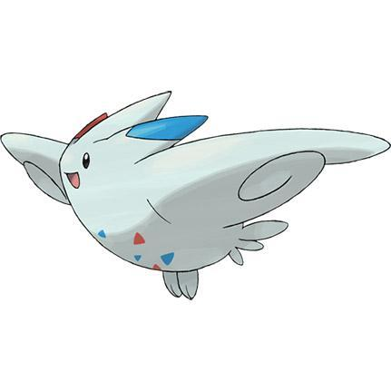 `pokemon_465.jpg` | **This is Togekiss (토게키스). It is a GEN IV Pokemon. A cheerful Togekiss soars gracefully with its white and blue-tipped wings spread wide, displaying its colorful triangular markings.** | This is a picture of the Pokémon "Mamoswine" (마모스와인). | This is Togekiss (토게키스). It is a GEN II Pokemon. A cheerful Togekiss, the evolution of Togepi, with its white body and triangular red and blue markings, looks ready for its next playful adventure. *(Retrieved: (Dist: 0.20) This is Togetic (토게틱). It is a GEN II Po...)* | This is the Pokémon named "Dawn Wings" in English and "조아라" in Korean. |
| 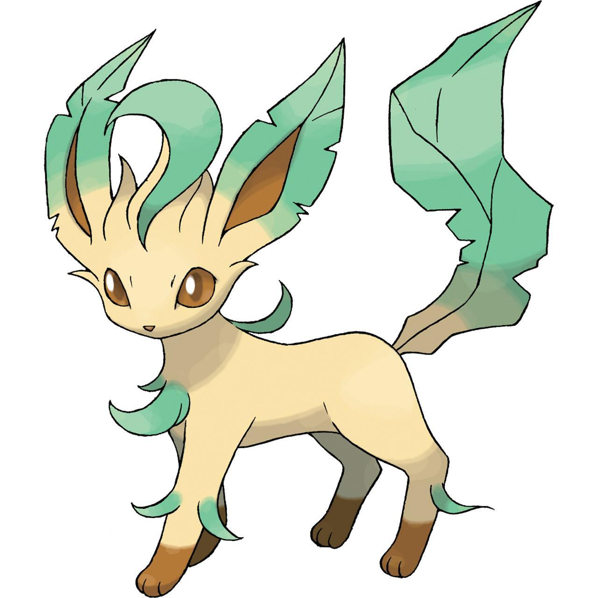 `pokemon_468.jpg` | **This is Leafeon (리피아). It is a GEN IV Pokemon. Leafeon, the verdant, fox-like Pokémon with leafy ears and tail, stands poised in a serene pose.** | This is Flareon, a Fire-type Pokémon. | This is Flareon (부스터). It is a GEN I Pokemon. *(Retrieved: (Dist: 0.18) This is Flareon (부스터). It is a GEN I Pok...)* | This is Flareon, a Fire-type Pokémon. |

## ✅ Trained Data Analysis (All Samples)
Checking retention of Gen 1-2 knowledge across all 24 samples.

| Image | Ground Truth | Vanilla | RAG | Tuned |
| :---: | :--- | :--- | :--- | :--- |
| 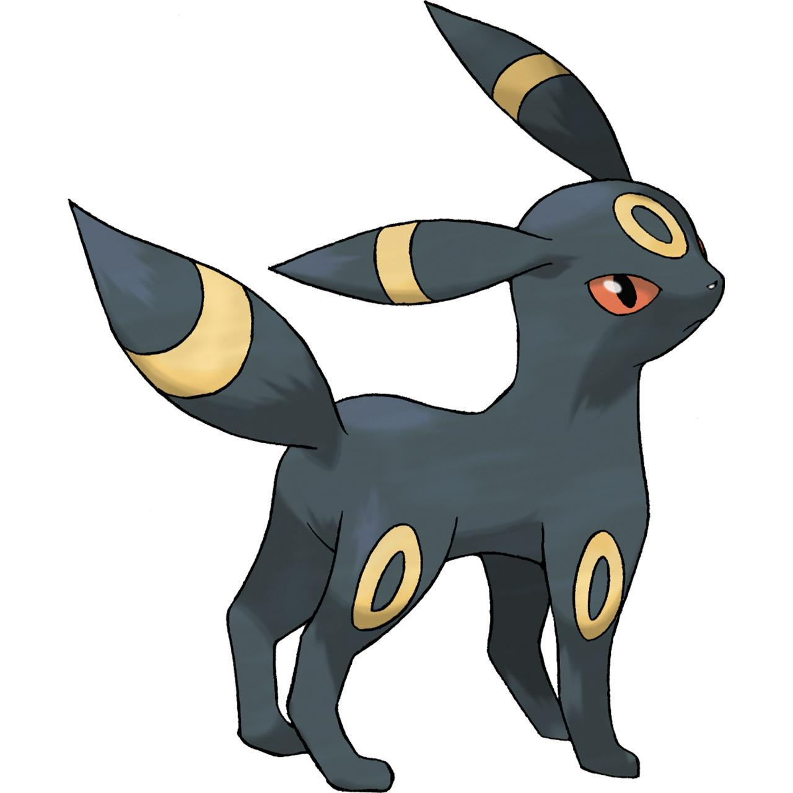 `pokemon_117.jpg` | **This is Umbreon (블래키). It is a GEN II Pokemon. A sleek, midnight blue-colored Pokémon known as Umbreon with bright, crimson eyes and yellow ring-like patterns on its ears and body stands attentively.** | This is Umbreon. | This is Umbreon (블래키). It is a GEN II Pokemon. | **This is Umbreon.** |
| 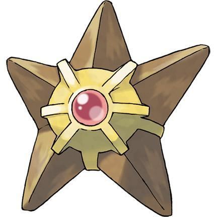 `pokemon_025.jpg` | **This is Staryu (별가사리). It is a GEN I Pokemon. A five-pointed, star-shaped illustration of a Staryu Pokémon with a reddish center surrounded by a yellow and beige body.** | This is the Pokémon called "Staraptor" in English and "별사다리" in Korean. | This is Staryu (별가사리). It is a GEN I Pokemon. A five-pointed, star-shaped illustration of a Staryu Pokémon with a reddish center surrounded by a yellow and beige body.  This is Staryu (별가사리). It is a GEN I Pokemon. A five-pointed, star-shaped illustration of a Staryu Pokémon with a reddish center surrounded by a yellow and beige body. | **This is the Pokémon called "Staraptor" in English and "별사다리" in Korean.** |
| 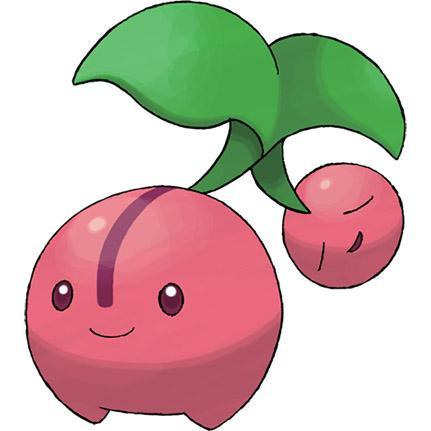 `pokemon_406.jpg` | **A cheerful pink cherry-like Pokémon with a big leaf on its head and a smaller companion berry floating nearby.** | This is a picture of a Pokémon called "Cherry" in English and "체리" in Korean. | This is the Pokémon called "Cherry" in English and "복숭아" in Korean. | **This is the Pokémon called "Cherry" in English and "체리" in Korean.** |
| 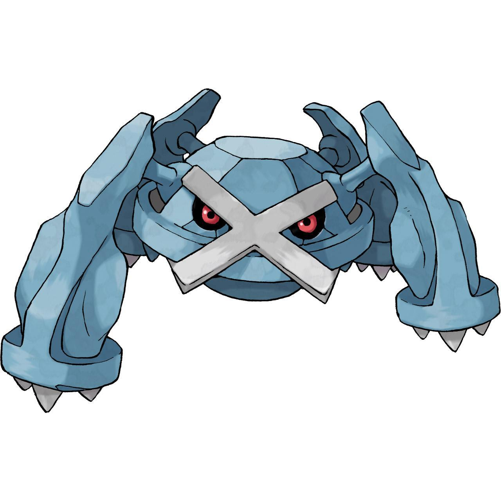 `pokemon_344.jpg` | **A blue, crab-like Pokémon with a hard shell and prominent claws stares intently, ready for battle.** | This is the Pokémon Zoroark. | This is the Pokémon named "Groudon." | **This is the Pokémon named "Groudon."** |
| 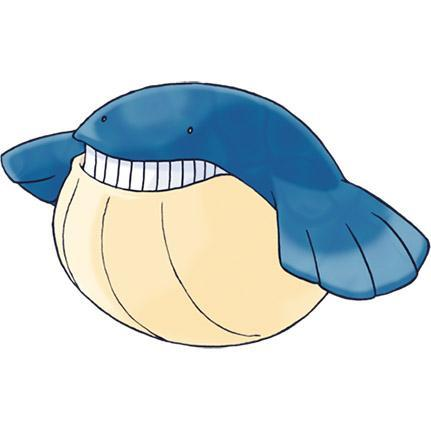 `pokemon_276.jpg` | **A smiling blue and cream-colored animated whale with prominent fins and a cheerful expression.** | This is the Pokémon named "Seel" in English and "세일" in Korean. | This is the Pokémon named "Seel" in English and "세일" in Korean. | **This is the Pokémon named "Goldeen" in English and "골든" in Korean.** |
| 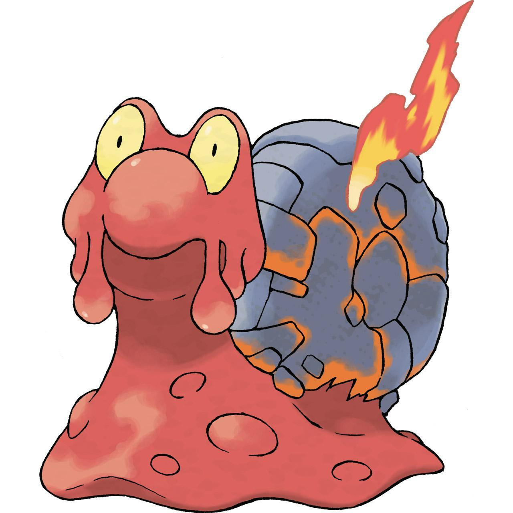 `pokemon_145.jpg` | **A colorful illustration of a slug-like creature with a flaming shell on its back.** | This is the Pokémon named "Caterpie" in English and "카터피" in Korean. | This is the Pokémon named "Caterpie" in English and "카터피" in Korean. | **This is the Pokémon named "Caterpie" in English and "카터피" in Korean.** |
| 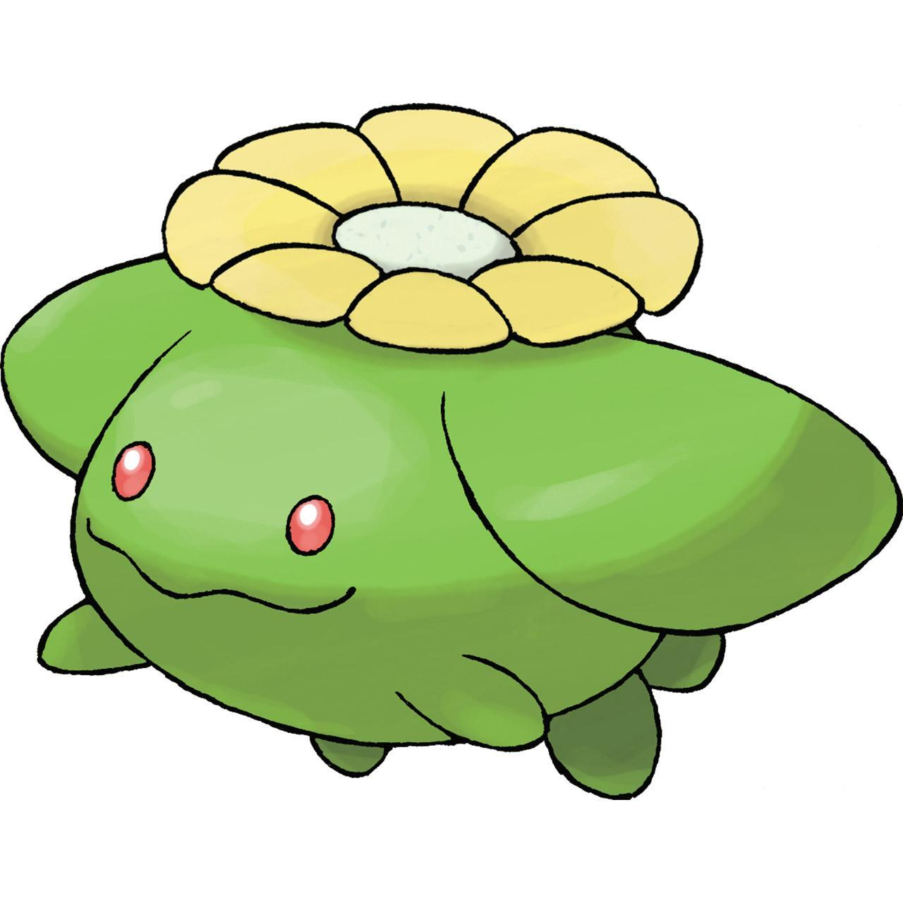 `pokemon_107.jpg` | **A smiling green Pokémon with a flower on its back and red eyes, resembling a small walking plant.** | This is the Pokémon called "Venusaur" in English and "버나우" in Korean. | This is the Pokémon called "Venusaur" in English and "버나우" in Korean. | **This is the Pokémon called "Venusaur" in English and "버나우" in Korean.** |
| 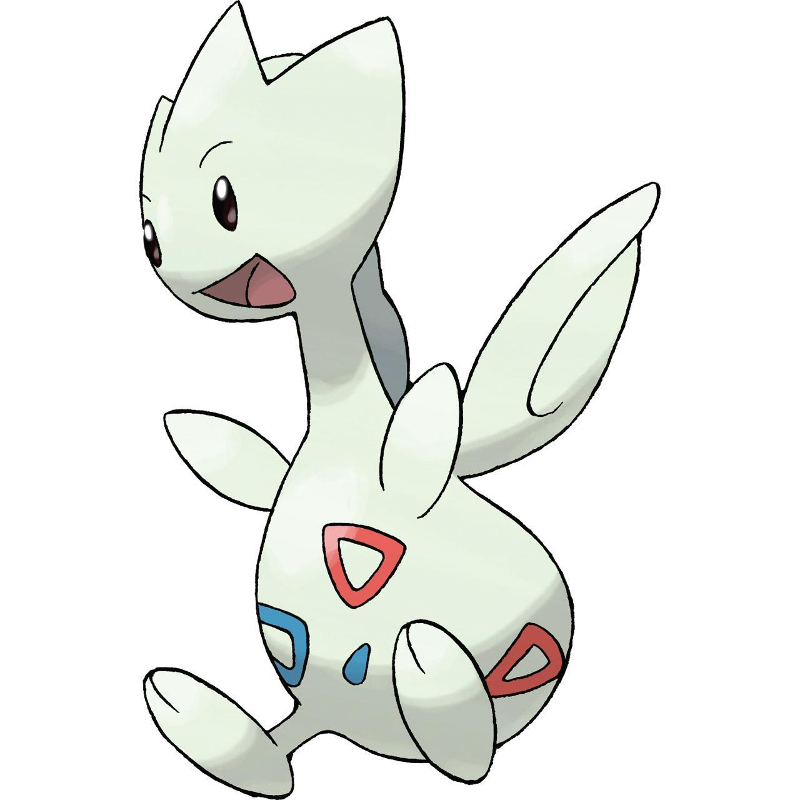 `pokemon_092.jpg` | **This is Togetic (토게틱). It is a GEN II Pokemon. A cheerful Togetic, the evolution of Togepi, with its white body and triangular red and blue markings, looks ready for its next playful adventure.** | This is the Pokémon named "Gardevoir" in English and "가드로어" in Korean. | This is Togetic (토게틱). It is a GEN II Pokemon. | **This is the Pokémon named "Gardevoir" in English and "가르디보어" in Korean.** |
| 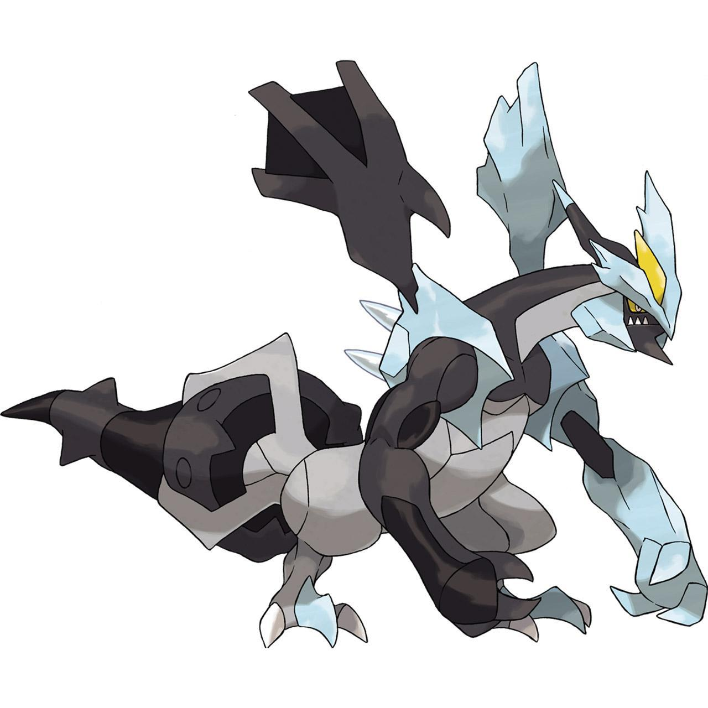 `pokemon_684.jpg` | **A ferocious and stylized illustration of a bipedal, mechanical dragon-like creature with icy blue accents and a menacing posture.** | This is the Pokémon Zoroark. | This is the Pokémon Zoroark. | **This is the Pokémon Zoroark.** |
| 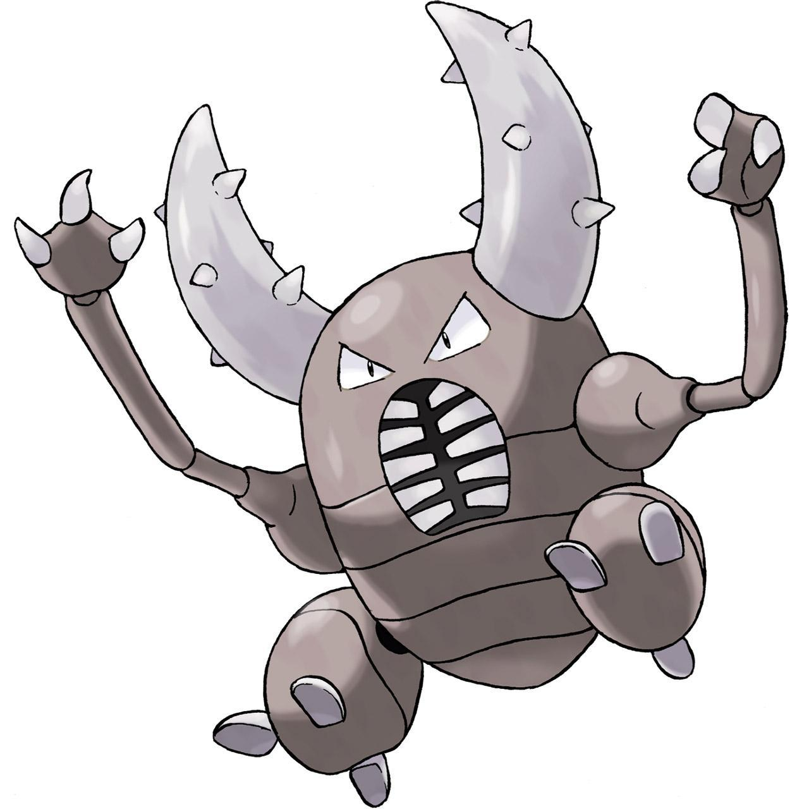 `pokemon_033.jpg` | **This is Pinsir (쁘사이저). It is a GEN I Pokemon. An illustration of Pinsir, a bug-type Pokémon, with large pincers and a fierce expression ready for battle.** | This is the Pokémon named "Groudon." | This is Pinsir (쁘사이저). It is a GEN I Pokemon. An illustration of Pinsir, a bug-type Pokémon, with large pincers and a fierce expression ready for battle. | **This is the Pokémon named "Groudon."** |
| 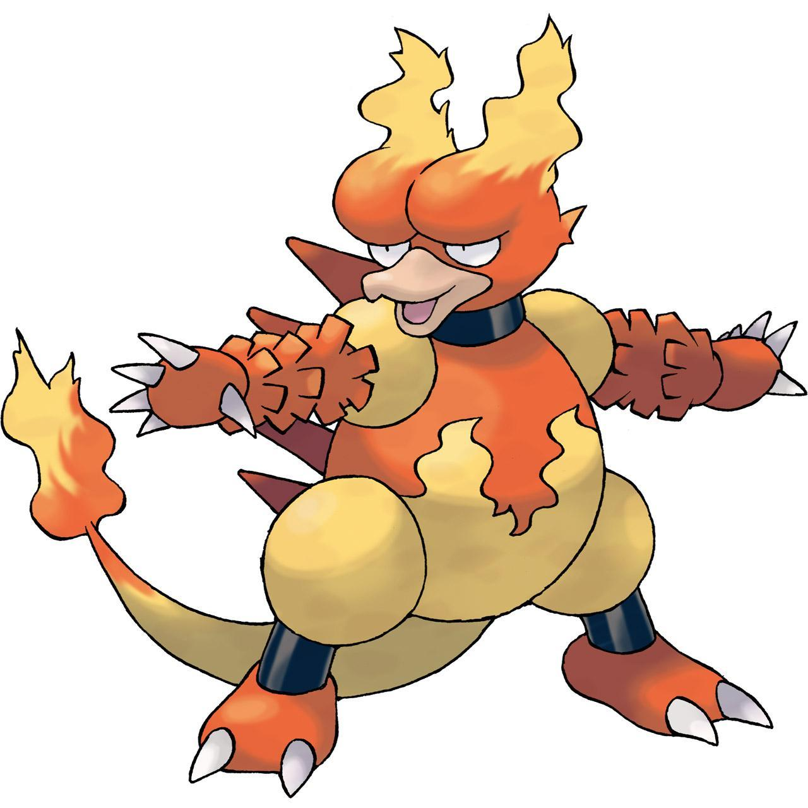 `pokemon_031.jpg` | **This is Magmar (마그마). It is a GEN I Pokemon. An illustration of Magmar, a fiery, duck-billed Pokémon with a body adorned with flame-like patterns, a tail tipped with fire, and clawed hands and feet.** | This is the Pokémon named "Growlithe" in English and "Growlithe" in Korean. | This is Magmar (마그마). It is a GEN I Pokemon. | **This is the Pokémon named "Growlithe" in English and "Growlithe" in Korean.** |
| 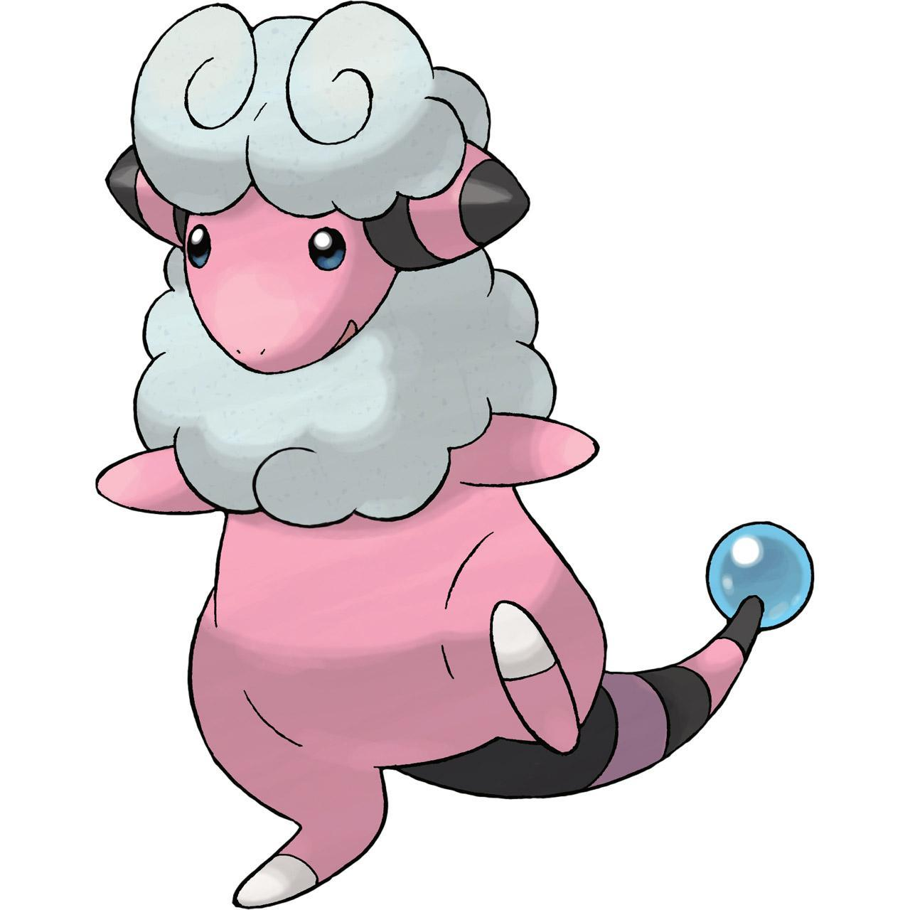 `pokemon_098.jpg` | **A cheerful pink and fluffy sheep-like creature with a whimsical curl on its forehead and a blue orb at the end of its tail.** | This is the Pokémon named "Lopunny" in English and "로분니" in Korean. | This is a picture of the Pokémon named "Lopunny." | **This is the Pokémon named "Lopunny" in English and "로분니" in Korean.** |
| 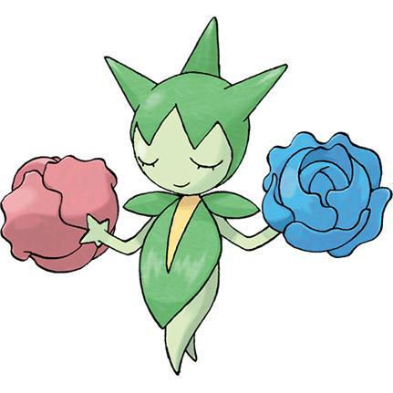 `pokemon_269.jpg` | **A serene animated character with a green humanoid appearance holds a pink flower in one hand and a blue flower in the other, exuding a peaceful and harmonious vibe.** | This is the Pokémon called "Gardevoir" in English and "가드로어" in Korean. | This is the Pokémon called "Gardevoir" in English and "가드로어" in Korean. | **This is the Pokémon named "Gardevoir" in English and "가드로어" in Korean.** |
| 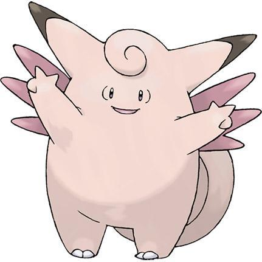 `pokemon_323.jpg` | **This is Clefable (픽시). It is a GEN I Pokemon. A cheerful pink Clefable with curled hair-like feature, waving its pointed fingered wings and smiling.** | This is the Pokémon named "Gardevoir" in English and "가드로어" in Korean. | This is Clefable (픽시). It is a GEN I Pokemon. A cheerful pink Clefable with curled hair-like feature, waving its pointed fingered wings and smiling. | **This is the Pokémon named "Gardevoir" in English and "가드로어" in Korean.** |
| 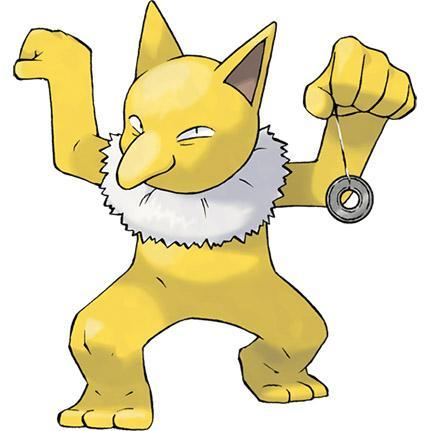 `pokemon_830.jpg` | **A confident, bipedal yellow feline Pokémon brandishes a silver pendulum with its right arm raised in triumph.** | This is Jigglypuff.  This is Jigglypuff. | This is Jigglypuff.  This is Jigglypuff. | **This is Jigglypuff.  This is Jigglypuff.** |
| 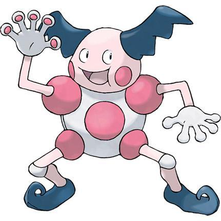 `pokemon_027.jpg` | **An animated character resembling a jester with a smiling face, blue appendages, and red orbs on its hands and body, assumes a playful, welcoming pose.** | This is the Pokémon named "Gardevoir" in English and "가드로어" in Korean. | This is the Pokémon named "Gardevoir" in English and "가드로어" in Korean. | **This is the Pokémon named "Gardevoir" in English and "가드로어" in Korean.** |
| 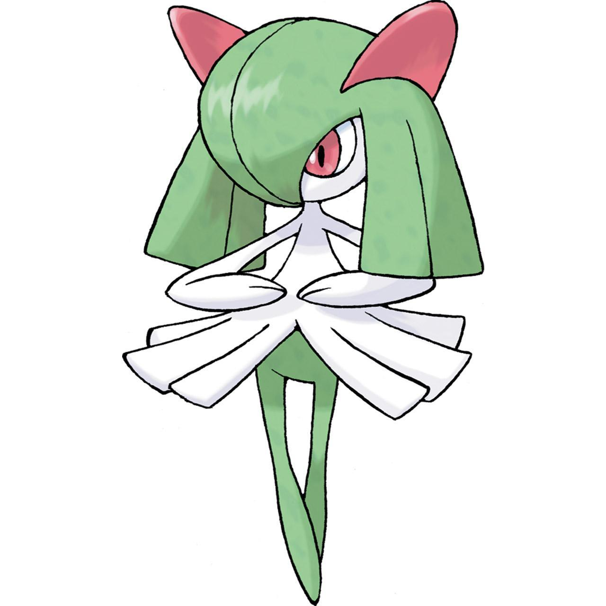 `pokemon_224.jpg` | **A graceful, humanoid Pokémon with a green and white color scheme, featuring large red eyes and long, leaf-like appendages.** | This is the Pokémon named "Mimikkyu" (ミミッキュー, Mimikkue) in Japanese and "Mimikyu" (ミミクイ, Mimikyu) in English. | This is the Pokémon named "Gardevoir" in English and "가드로어" in Korean. | **This is the Pokémon named "Mimikkyo" ( Mimikyu in English).** |
| 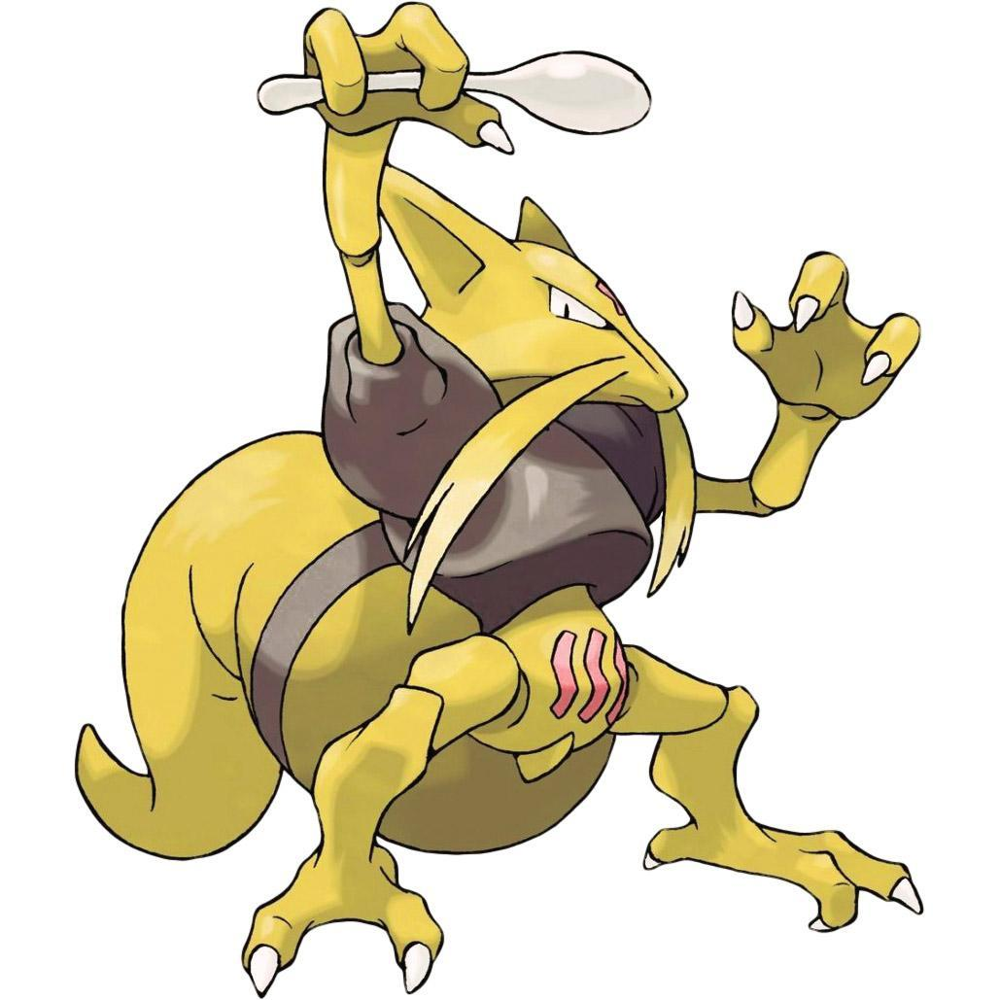 `pokemon_674.jpg` | **This is Kadabra (윤겔라). It is a GEN I Pokemon. A poised Kadabra, an animated psychic-type Pokémon, brandishing a silver spoon, ready to unleash its telekinetic powers.** | This is the Pokémon named "Groudon" in English and "그루돈" in Korean. | This is the Pokémon called **Kadabra** (윤겔라). It is a GEN I Pokémon. | **This is the Pokémon named "Groudon" in English and "그루돈" in Korean.** |
| 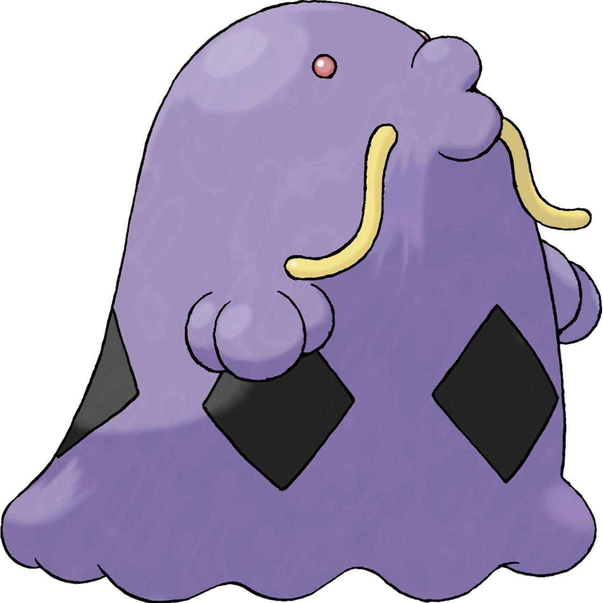 `pokemon_271.jpg` | **A whimsical drawing of a purple, amorphous creature with a squiggly antenna, simplistic eyes, and two black patches on its front, reminiscent of a playful cartoon character.** | This is the Pokémon named "Gengar" in English and "강가르" in Korean. | This is the Pokémon named "Gengar" in English and "강가" in Korean. | **This is the Pokémon named "Gengar" in English and "강가" in Korean.** |
| 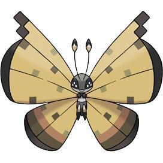 `pokemon_727.jpg` | **This is Beedrill (독침붕). It is a GEN I Pokemon. An illustration of a Beedrill, a bee-like Pokémon with large stinger-like forelimbs and wings, showcasing its distinctive yellow and black pattern.** | This is a Butterfree.   This is a 버터플. | This is Beedrill (독침붕). It is a GEN I Pokemon. | **This is the Pokémon Butterfree.  This is the Pokémon 버터플.  This is the Pokémon 버터플.** |
| 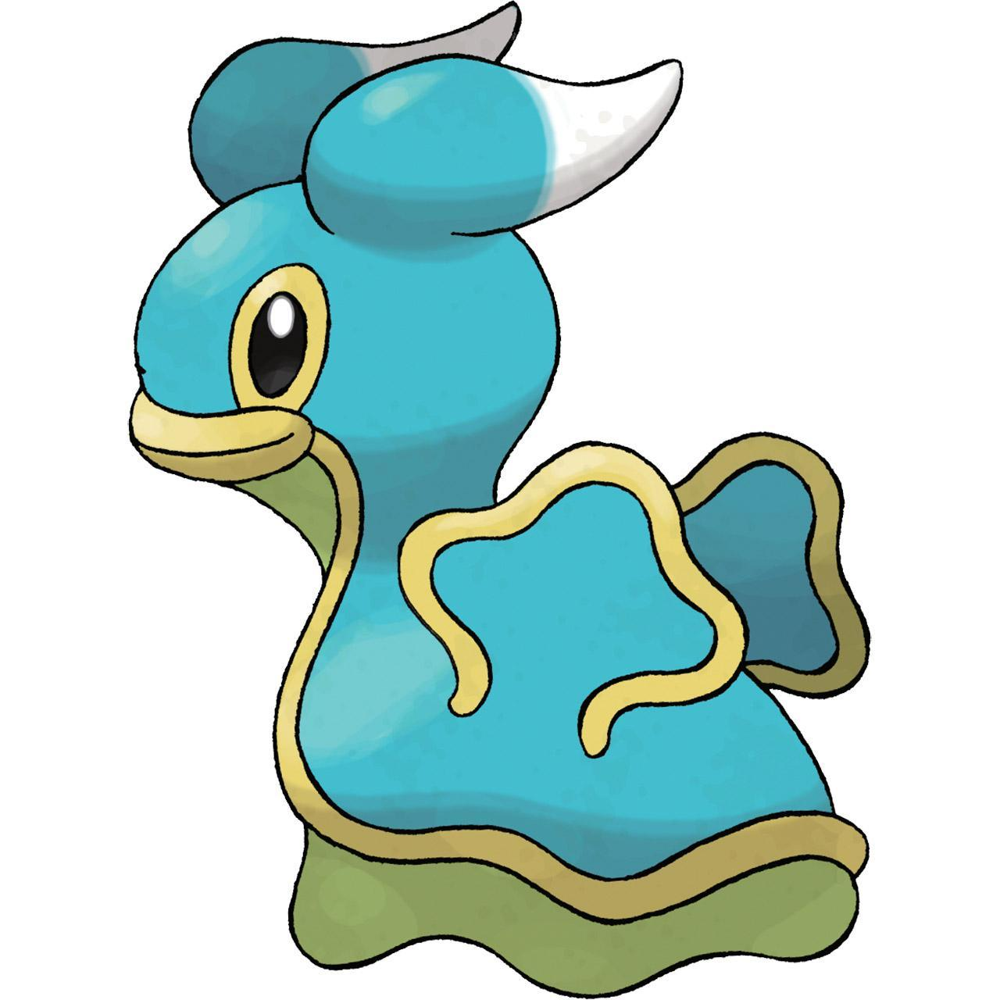 `pokemon_409.jpg` | **A cheerful blue duck-like Pokémon with a prominent swirl pattern on its stomach poses playfully, ready for its next adventure.** | This is the Pokémon named "Drapion" in English and "드라피온" in Korean. | This is the Pokémon named "Dedenne" (デデネ). | **This is the Pokémon named "Swampert" (Swampert) in English and "하수어" (Haseo) in Korean.** |
| 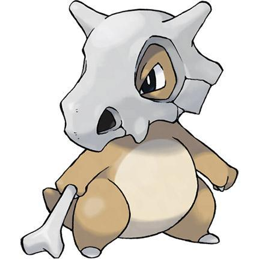 `pokemon_006.jpg` | **This is Cubone (탕구리). It is a GEN I Pokemon. A Cubone, the lonely Pokémon, sits clutching its signature bone, its face hidden by a skull helmet.** | This is a picture of the Pokémon named "Cubone." In English, it is called "Cubone," and in Korean, it is called "크루본" (Kreu-bon). | This is Cubone (탕구리). It is a GEN I Pokemon. A Cubone, the lonely Pokémon, sits clutching its signature bone, its face hidden by a skull helmet. | **This is the Pokémon named "Cubone" in English and "크라우드" in Korean.** |
| 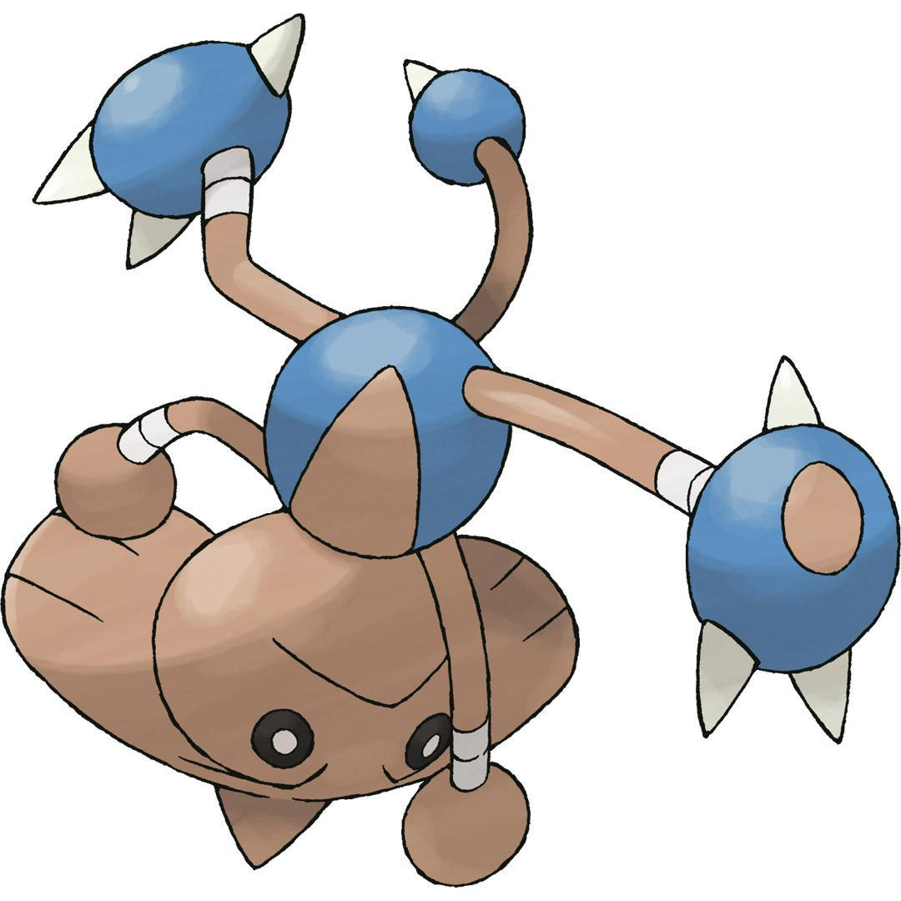 `pokemon_166.jpg` | **This is Hitmontop (카포에라). It is a GEN II Pokemon. "A Hitmontop, a Fighting-type Pokémon, spinning on its head with its legs outstretched, ready for battle."** | This is the Pokémon named "Dugtrio" in English and "도그트로" in Korean. | This is Hitmontop (카포에라). It is a GEN II Pokemon. "A Hitmontop, a Fighting-type Pokémon, spinning on its head with its legs outstretched, ready for battle." | **This is the Pokémon named "Dugtrio" in English and "도그트로" in Korean.** |
| 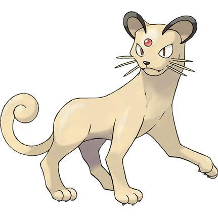 `pokemon_542.jpg` | **This is Persian (페르시온). It is a GEN I Pokemon. An illustration of Persian, a cream-colored, feline Pokémon with a lithe body, a red forehead gem, and a gracefully curled tail.** | This is a Persian Pokémon. In Korean, it is called "페르시안" (Peurisan). | This is Persian (페르시온). It is a GEN I Pokemon. | **This is the Pokémon Meowth. In Korean, it is called "미우스" (Miusu).** |
|  `pokemon_030.jpg` | **This is Electivire (에레키블). It is a GEN IV Pokemon. An animated image of Electivire, a powerful Electric-type Pokémon, poised in a dynamic battle stance ready to unleash its next electrifying move.** | This is the Pokémon Zoroark. | This is Electabuzz (에레브). It is a GEN I Pokémon. | **This is the Pokémon Zoroark.** |
|  `pokemon_439.jpg` | **This is Munchlax (먹고자). It is a GEN IV Pokemon. "A cheerful Munchlax smiling wide, ready for its next meal or battle!"** | This is the Pokémon named "Dedenne" in English and "디덴네" in Korean. | This is Snorlax (잠만보). It is a GEN I Pokemon. A smiling Snorlax sits contentedly with its arms resting at its sides and eyes closed in relaxation. | **This is the Pokémon named "Dugtrio" in English and "도그트로" in Korean.** |
|  `pokemon_469.jpg` | **This is Glaceon (글레이시아). It is a GEN IV Pokemon. A poised Glaceon, an ice-type Pokémon evolution of Eevee, displaying its cool blue color scheme and ice-crystal ear and tail features.** | This is Glaceon, a Pokémon from the Pokémon series. | This is Umbreon (블래키). It is a GEN II Pokemon. | **This is Glaceon, a Pokémon from the Pokémon series.** |
|  `pokemon_460.jpg` | **This is Lickilicky (내룸벨트). It is a GEN IV Pokemon. A happy pink Lickilicky, a Pokémon with a prominent tongue and a curvy yellow pattern on its belly, stands ready for its next adventure.** | This is the Pokémon named "Dugtrio" in English and "도그트로" in Korean. | This is Lickitung (내루미). It is a GEN I Pokemon. A cheerful pink Lickitung with its long tongue lolling out is ready for a Pokémon battle. | **This is the Pokémon named "Gastly" in English and "가스트리" in Korean.** |
|  `pokemon_465.jpg` | **This is Togekiss (토게키스). It is a GEN IV Pokemon. A cheerful Togekiss soars gracefully with its white and blue-tipped wings spread wide, displaying its colorful triangular markings.** | This is a picture of the Pokémon "Mamoswine" (마모스와인). | This is Togekiss (토게키스). It is a GEN II Pokemon. A cheerful Togekiss, the evolution of Togepi, with its white body and triangular red and blue markings, looks ready for its next playful adventure. | **This is the Pokémon named "Dawn Wings" in English and "조아라" in Korean.** |
|  `pokemon_468.jpg` | **This is Leafeon (리피아). It is a GEN IV Pokemon. Leafeon, the verdant, fox-like Pokémon with leafy ears and tail, stands poised in a serene pose.** | This is Flareon, a Fire-type Pokémon. | This is Flareon (부스터). It is a GEN I Pokemon. | **This is Flareon, a Fire-type Pokémon.** |
