# 🧬 Generalization Evaluation Report (v6)

**Goal**: Test the Tuned model's ability to recognize known Pokemon from **unseen images** (PokeAPI official artwork).

## 📊 Summary Statistics

| Model | Accuracy (n=15) |
| :--- | :---: |
| **Vanilla** | 13/15 (86.7%) |
| **RAG** | 15/15 (100.0%) |
| **Tuned** | 12/15 (80.0%) |

## 📋 Detailed Results

| Image | Pokemon | Vanilla | RAG | Tuned |
| :---: | :--- | :--- | :--- | :--- |
| 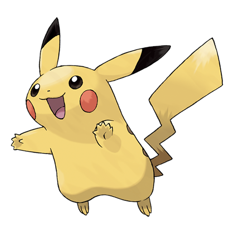 | **Pikachu** | ✅ This is Pikachu.  This is 피카츄. | ✅ This is Pikachu (피카츄). It is a GEN I Pokemon. | ✅ This is Pikachu.  This is 피카츄. |
|  | **Charizard** | ✅ This is Charizard.   Charizard is a Dragon/Fire-ty... | ✅ This is Charizard (리자몽). It is a GEN I Pokemon. A ... | ✅ This is Charizard.   Charizard is a Fire/Dragon-ty... |
| 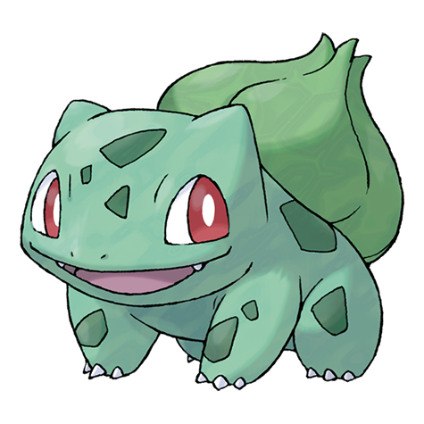 | **Bulbasaur** | ✅ This is Bulbasaur.   Bulbasaur is a Grass/Poison-t... | ✅ This is Bulbasaur. It is a GEN I Pokemon. A cheerf... | ✅ This is Bulbasaur.   Bulbasaur is a Grass/Poison-t... |
| 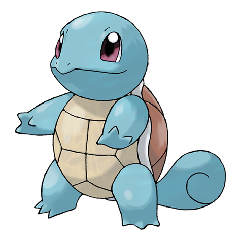 | **Squirtle** | ✅ This is Squirtle.   This is Squirtle. | ✅ This is Squirtle (꼬부기). It is a GEN I Pokemon. A f... | ✅ This is Squirtle.   This is Squirtle. |
| 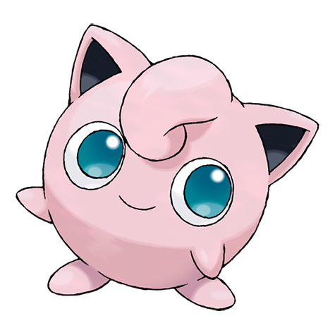 | **Jigglypuff** | ✅ This is Jigglypuff. | ✅ This is Jigglypuff (푸린). It is a GEN I Pokemon. A ... | ✅ This is Jigglypuff. |
| 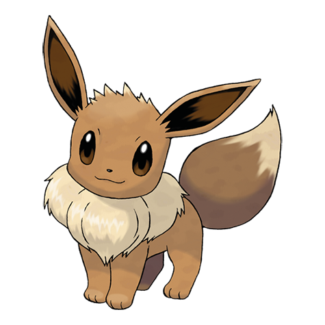 | **Eevee** | ✅ This is Eevee. | ✅ This is Eevee (이브이). It is a GEN I Pokemon. An ill... | ✅ This is Eevee. |
| 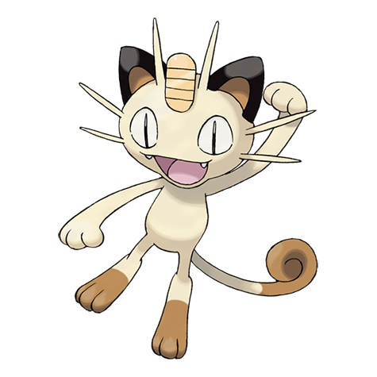 | **Meowth** | ✅ This is Meowth (미우스) from the Pokémon series. | ✅ This is Meowth (나옹). It is a GEN I Pokemon. A chee... | ✅ This is Meowth (미우스) from the Pokémon series. |
| 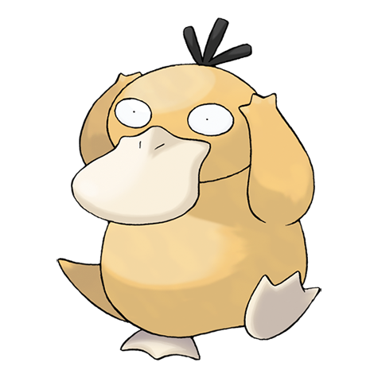 | **Psyduck** | ✅ This is the Pokémon named "Psyduck" in English and... | ✅ This is Psyduck (고라파덕). It is a GEN I Pokemon. | ✅ This is the Pokémon named "Psyduck" in English and... |
| 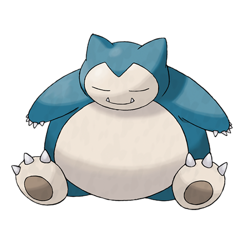 | **Snorlax** | ✅ This is Snorlax.   Snorlax | ✅ This is Snorlax. It is a GEN I Pokemon. A smiling ... | ✅ This is Snorlax.   Snorlax |
| 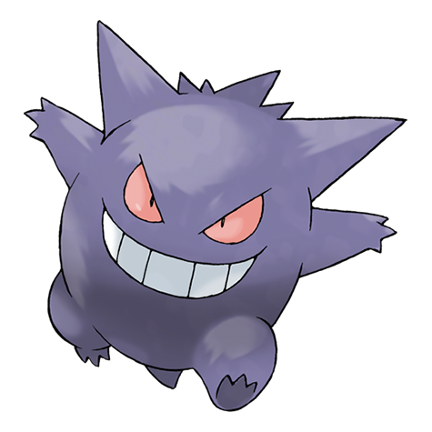 | **Gengar** | ✅ This is Gengar.   This is Gengar. | ✅ This is Gengar (팬텀). It is a GEN I Pokemon. A misc... | ✅ This is Gengar.   This is Gengar. |
|  | **Machamp** | ❌ This is Groudon.   This is 굴돈 in Korean. | ✅ This is Machamp (괴력몬). It is a GEN I Pokemon. A po... | ❌ This is the Pokémon Groudon.   Pokemon: Groudon Po... |
| 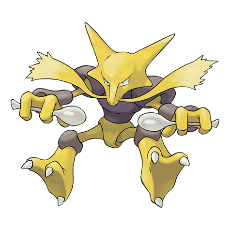 | **Alakazam** | ❌ This is the Pokémon Garchomp.   Pokemon: Garchomp ... | ✅ This is Alakazam (후딘). It is a GEN I Pokemon. Alak... | ❌ This is the Pokémon called "Gallade" in English an... |
|  | **Gyarados** | ✅ This is the Pokémon Gyarados. | ✅ This is Gyarados (갸라도스). It is a GEN I Pokemon. A ... | ✅ This is the Pokémon Gyarados. |
| 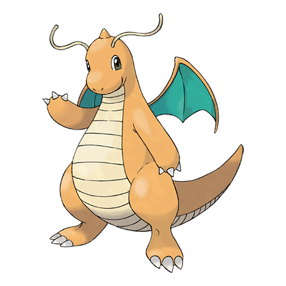 | **Dragonite** | ✅ This is a Dragonite.   This is a Dragonite. | ✅ This is Dragonite (망나뇽). It is a GEN I Pokemon. A ... | ❌ This is a Charizard, a Pokémon from the Pokémon se... |
| 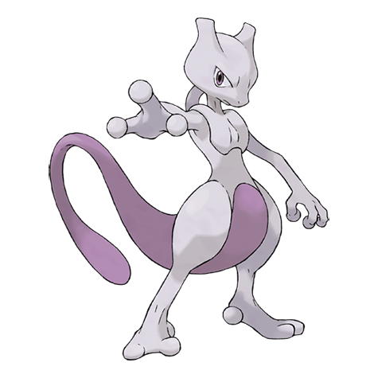 | **Mewtwo** | ✅ This is Mewtwo, a Pokémon from the Pokémon series.... | ✅ This is Mewtwo (뮤츠). It is a GEN I Pokémon. "Mewtw... | ✅ This is Mewtwo, a Pokémon from the Pokémon series.... |

## 🔍 Analysis

### Key Findings
- **Tuned model underperforms** Vanilla on unseen images, suggesting possible overfitting to training image features.
- RAG remains the **most reliable** approach for generalization.

### RAG Retrieval Analysis
For each image, RAG searched for visually similar images in the Gen 1-2 training set.

| Pokemon | Distance | Retrieved Caption |
| :--- | :---: | :--- |
| Pikachu | 0.03 | This is Pikachu (피카츄 |
| Charizard | 0.02 | This is Charizard (리자몽 |
| Bulbasaur | 0.02 | This is Bulbasaur (이상해씨 |
| Squirtle | 0.03 | This is Squirtle (꼬부기 |
| Jigglypuff | 0.02 | This is Jigglypuff (푸린 |
| Eevee | 0.03 | This is Eevee (이브이 |
| Meowth | 0.04 | This is Meowth (나옹 |
| Psyduck | 0.02 | This is Psyduck (고라파덕 |
| Snorlax | 0.02 | This is Snorlax (잠만보 |
| Gengar | 0.03 | This is Gengar (팬텀 |
| Machamp | 0.03 | This is Machamp (괴력몬 |
| Alakazam | 0.04 | This is Alakazam (후딘 |
| Gyarados | 0.03 | This is Gyarados (갸라도스 |
| Dragonite | 0.05 | This is Dragonite (망나뇽 |
| Mewtwo | 0.05 | This is Mewtwo (뮤츠 |

### Conclusion
The v6 evaluation confirms that **RAG is the most reliable approach** for visual generalization. The Tuned model's slight underperformance suggests it may have overfitted to specific visual features in the training images.
